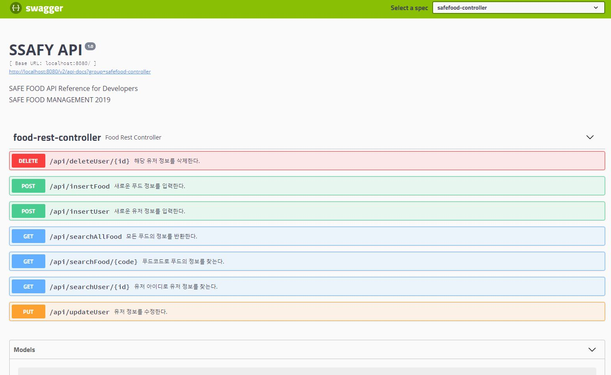

# SpringSafeFood_서울_06반_정구헌&채상훈

< 기능구현 >

1) Swagger  
RestFul api document를 제작  
  

0) 메인페이지
  
1) 식품 정보 (영양분, 첨가물 ) 목록 서비스 (Spring & MyBais 기반)  
  
2) 식품 정보 (영양분, 첨가물 ) 상세 서비스 (Spring & MyBais 기반) 
  

o 회원 정보 관리

1) 회원 가입  
 

2) 회원 정보 조회&수정 
   

3) 회원 정보 삭제(탈퇴) 
    

4) 로그인/ 로그아웃 기능  
   
   
   

